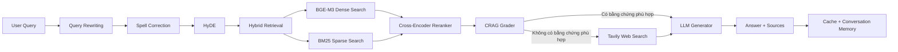

# Advanced Vietnamese Medical RAG Chatbot

Hệ thống hỏi–đáp y tế tiếng Việt sử dụng **Advanced Retrieval-Augmented Generation (RAG)**, kết hợp truy xuất từ khóa, truy xuất ngữ nghĩa, reranking, kiểm định bằng chứng và mô hình ngôn ngữ lớn để tạo câu trả lời có nguồn tham khảo.

> **Cảnh báo y tế:** Hệ thống chỉ hỗ trợ cung cấp thông tin tham khảo, không thay thế chẩn đoán, kê đơn hoặc tư vấn trực tiếp từ bác sĩ.

## 1. Tổng quan

Pipeline chính:



Các chức năng chính:

- Sửa lỗi chính tả tiếng Việt nhưng không trả lời thay người dùng.
- Viết lại câu hỏi phụ thuộc lịch sử hội thoại.
- HyDE để cải thiện truy xuất ngữ nghĩa.
- Hybrid Search: BGE-M3 Dense Retrieval + BM25 Sparse Retrieval.
- Cross-Encoder reranking trên child chunk.
- CRAG kiểm tra đúng chủ đề, đúng ý định và có bằng chứng trực tiếp.
- Tavily fallback khi kho dữ liệu nội bộ không có tài liệu đủ phù hợp.
- Sinh câu trả lời có khuyến cáo an toàn và nguồn trích dẫn.
- Cache ba tầng và bộ nhớ hội thoại tối đa 5 lượt.
- FastAPI để tích hợp với giao diện web.
- Ngrok để tạo URL công khai từ Google Colab.

## 2. Thành phần kỹ thuật

| Thành phần           | Công nghệ/cấu hình                           |
| -------------------- | -------------------------------------------- |
| Dense embedding      | `BAAI/bge-m3`                                |
| Kích thước embedding | 1.024 chiều                                  |
| Sparse retrieval     | BM25 Okapi (`rank_bm25`)                     |
| Reranker             | `cross-encoder/mmarco-mMiniLMv2-L12-H384-v1` |
| Vector database      | ChromaDB, cosine distance                    |
| FAST/Auxiliary LLM   | `openai/gpt-oss-20b` qua Groq                |
| STRONG/Final LLM     | `qwen/qwen3-32b` qua Groq                    |
| Web fallback         | Tavily Search                                |
| API                  | FastAPI + Uvicorn                            |
| Public tunnel        | ngrok                                        |
| Môi trường           | Google Colab GPU                             |

Cấu hình dữ liệu production hiện tại:

- Kho dữ liệu sau làm sạch: khoảng **68.498 parent documents**.
- Số child chunks: khoảng **413.344 chunks**.
- Chunk size: **250 từ**.
- Overlap: **50 từ**.
- Embedding được tạo từ `question_cleaned + answer_cleaned chunk`.
- Evidence đưa vào CRAG và generator chỉ chứa answer chunk sạch.

## 3. Notebook

Notebook chính:

```text
rag.ipynb
```

Notebook được thiết kế để chạy trên Google Colab. Không nên `Run all` một cách máy móc vì trong notebook có cả cell tải model online cũ và cell load model local từ Google Drive.

## 4. Yêu cầu

### 4.1. Google Colab

Chọn GPU:

```text
Runtime → Change runtime type → T4 GPU hoặc A100
```

### 4.2. Colab Secrets

Thêm các secret sau và bật quyền truy cập notebook:

| Secret            |                 Bắt buộc | Mục đích                                                |
| ----------------- | -----------------------: | ------------------------------------------------------- |
| `GROQ_API_KEY`    |                       Có | Query rewriting, sửa chính tả, HyDE, CRAG và generation |
| `TAVILY_API_KEY`  |           Không bắt buộc | Web fallback khi tài liệu local không đủ phù hợp        |
| `NGROK_AUTHTOKEN` | Chỉ khi mở API công khai | Tạo ngrok tunnel                                        |

Không ghi trực tiếp API key vào notebook hoặc commit lên GitHub.

### 4.3. File backup trên Google Drive

Cấu trúc khuyến nghị:

```text
MyDrive/
├── medical_rag_backups/
│   └── medical_rag_prod.zip
└── medical_rag_models/
    ├── bge-m3-model.zip
    └── mmarco-reranker.zip
```

`medical_rag_prod.zip` phải chứa trực tiếp:

```text
chroma_db/
bm25_child_chunks.json
index_manifest.json
parent_docs.json
```

`bge-m3-model.zip` phải chứa trực tiếp các file model, ví dụ:

```text
1_Pooling/config.json
config.json
config_sentence_transformers.json
modules.json
sentence_bert_config.json
sentencepiece.bpe.model
special_tokens_map.json
tokenizer.json
tokenizer_config.json
pytorch_model.bin
```

## 5. Cài đặt thư viện

Cell cài đặt chính trong notebook:

```python
%pip install -q \
  pandas pyarrow chromadb sentence-transformers \
  rank_bm25 tavily-python tqdm nest-asyncio groq
```

Phần API:

```python
%pip install -q fastapi uvicorn pyngrok nest-asyncio
```

Phần metric:

```python
%pip install -q rouge-score bert-score underthesea
```

## 6. Cấu hình production

Trong cell cấu hình, sử dụng:

```python
DEV_MODE = False
FORCE_REBUILD_INDEX = False
RESTORE_FROM_DRIVE = True
USE_DRIVE_BACKUP = True
REQUIRE_GPU = True
```

Khuyến nghị khi chạy production:

```python
AUTO_RESET_BROKEN_INDEX = False
```

Thiết lập này giúp notebook báo lỗi rõ ràng thay vì tự xóa ChromaDB local nếu quá trình mở index gặp lỗi.

Collection production:

```text
medical_hybrid_prod_qa_v2
```

## 7. Thứ tự chạy sau khi mở runtime mới

### Bước 1 — Cài thư viện

Chạy cell cài package.

### Bước 2 — Khởi tạo Groq, Tavily, cache và memory

Chạy các cell:

- Imports và đọc Colab Secrets.
- Khởi tạo Groq/Tavily client.
- `RAGCache`.
- `ConversationMemory`.
- Query rewriting.

Output mong đợi:

```text
[OK] Groq Client đã sẵn sàng.
```

### Bước 3 — Restore index production

Notebook hiện có nhiều cell liên quan restore. Chỉ cần chạy **một luồng restore hoàn chỉnh**, khuyến nghị cell có cấu hình:

```python
DEV_MODE = False
RESTORE_FROM_DRIVE = True
```

Output mong đợi:

```text
[OK] Chế độ: PROD
[OK] Số dòng: FULL DATASET
[OK] Collection: medical_hybrid_prod_qa_v2
```

### Bước 4 — Restore BGE-M3 từ Drive

Giải nén model vào:

```text
/content/models/bge-m3
```

Sau đó phải thấy:

```text
[READY] BGE-M3 local đã đầy đủ.
```

### Bước 5 — Load BGE-M3 local và mở ChromaDB

Model phải được load bằng đường dẫn local:

```python
SentenceTransformer(
    "/content/models/bge-m3",
    device="cuda",
    local_files_only=True,
)
```

Không dùng lại:

```python
SentenceTransformer("BAAI/bge-m3")
```

Output production mong đợi:

```text
[INFO] ChromaDB hiện có: 413344 chunks
```

Nếu ChromaDB có `0 chunks`, dừng lại và kiểm tra backup; không tiếp tục build lại ngoài ý muốn.

### Bước 6 — Load parent documents và BM25

Output mong đợi:

```text
[OK] Loaded 68498 parents, 413344 child chunks.
[OK] Hoàn thành khởi tạo Vector Store & BM25 Sparse Retriever.
```

Khi chỉ restore index có sẵn, giữ dòng backup ở trạng thái comment:

```python
# backup_completed_index()
```

Chỉ gọi lại hàm backup sau khi thật sự xây một index mới.

### Bước 7 — Restore và load reranker local

C1: Download reranker: Nếu download chậm, thực hiện cách 2

```python
CrossEncoder(
    "cross-encoder/mmarco-mMiniLMv2-L12-H384-v1"
)
```

C2:
Giải nén reranker vào:

```text
/content/models/mmarco-reranker
```

Chạy cell local:

```python
reranker = CrossEncoder(
    "/content/models/mmarco-reranker",
    device=DEVICE,
    local_files_only=True,
)
```

### Bước 8 — Định nghĩa pipeline và chatbot

Chạy các cell chứa:

```text
query_processing
hybrid_retrieve_and_rerank
crag_grade_and_refine
generate_safe_answer
ask_medical_chatbot
```

### Bước 9 — Test chatbot trực tiếp

```python
result = ask_medical_chatbot(
    "Hiện tượng ngủ mở mắt có hại không?",
    session_id="demo-user-001",
    verbose=True,
)

result
```

## 8. Cách pipeline hoạt động

### 8.1. Query rewriting

Chỉ kích hoạt khi câu hỏi phụ thuộc lịch sử, ví dụ:

```text
Uống thuốc gì?
Có tác dụng phụ không?
Bệnh này có nguy hiểm không?
```

Câu hỏi độc lập, dù ngắn, vẫn được giữ nguyên.

### 8.2. Cache ba tầng

| Cache        | Key                | Value                 |
| ------------ | ------------------ | --------------------- |
| Spell cache  | Câu hỏi gốc        | Câu đã sửa chính tả   |
| HyDE cache   | Câu đã sửa         | Hypothetical document |
| Answer cache | Câu hỏi đã rewrite | Kết quả đầy đủ        |

TTL mặc định:

```text
3.600 giây
```

Xóa cache và memory:

```python
cache.clear()
session_memories.clear()
```

### 8.3. Hybrid retrieval

- Dense Search lấy ứng viên từ ChromaDB bằng BGE-M3.
- BM25 tìm ứng viên theo từ khóa chính xác.
- Chỉ giữ BM25 candidate có score lớn hơn 0.
- Hai danh sách được hợp nhất và khử trùng lặp theo child ID.
- Cross-Encoder rerank child chunks.
- Chọn tối đa 3 parent documents khác nhau.

### 8.4. CRAG

Một tài liệu chỉ được chấp nhận khi đồng thời thỏa mãn:

```text
same_subject = true
answers_question = true
direct_evidence = true
quote_valid = true
```

`quote_valid` yêu cầu đoạn trích do CRAG trả về phải xuất hiện nguyên văn trong evidence.

### 8.5. Tavily fallback

Khi không có tài liệu local nào vượt qua CRAG:

```text
Local retrieval thất bại
→ Tavily Search
→ Generator
```

Có thể tắt khi benchmark:

```python
ENABLE_TAVILY_FALLBACK = False
```

### 8.6. Generation và safety

Generator chỉ được yêu cầu sử dụng ngữ cảnh đã cung cấp và luôn thêm khuyến cáo:

```text
Khuyến cáo: Thông tin trên chỉ mang tính chất tham khảo,
hãy đến cơ sở y tế gần nhất để thăm khám kịp thời.
```

RAG làm giảm nguy cơ hallucination nhưng không thể bảo đảm loại bỏ hoàn toàn sai sót.

## 9. FastAPI

### 9.1. Endpoint

| Method | Endpoint    | Chức năng                         |
| ------ | ----------- | --------------------------------- |
| `GET`  | `/`         | Thông tin service                 |
| `GET`  | `/health`   | Kiểm tra model, index và pipeline |
| `POST` | `/api/chat` | Gửi câu hỏi chatbot               |
| `GET`  | `/docs`     | Swagger UI                        |

### 9.2. Request

```http
POST /api/chat
Content-Type: application/json
```

```json
{
  "query": "Hiện tượng ngủ mở mắt là gì?",
  "session_id": "user-123"
}
```

- `query`: bắt buộc, từ 1 đến 2.000 ký tự.
- `session_id`: bắt buộc, từ 1 đến 200 ký tự.
- Giữ nguyên `session_id` trong cùng một cuộc trò chuyện.

### 9.3. Response

```json
{
  "original_query": "Hiện tượng ngủ mở mắt là gì?",
  "rewritten_query": "Hiện tượng ngủ mở mắt là gì?",
  "fixed_query": "Hiện tượng ngủ mở mắt là gì?",
  "answer": "...",
  "sources": [],
  "cache_hit": false,
  "success": true
}
```

### 9.4. Health check

```bash
curl http://127.0.0.1:8000/health
```

Kết quả production mong đợi:

```json
{
  "status": "ok",
  "ready": true,
  "components": {
    "embedding_fn": true,
    "collection": true,
    "bm25": true,
    "reranker": true,
    "chatbot": true
  },
  "chroma_count": 413344
}
```

### 9.5. Hạn chế xử lý đồng thời

API sử dụng `pipeline_lock`, do đó chỉ xử lý một request GPU tại một thời điểm. Request đến sau sẽ chờ request trước hoàn tất. Cấu hình này phù hợp cho demo và tránh tràn VRAM.

## 10. Ngrok

Sau khi FastAPI local trả `200`, tạo tunnel:

```python
public_tunnel = ngrok.connect(
    addr="127.0.0.1:8000",
    proto="http",
)
```

Hoặc sử dụng Dev Domain cố định thuộc tài khoản ngrok của dự án:

```python
NGROK_FIXED_URL = "https://<your-domain>.ngrok-free.dev"

public_tunnel = ngrok.connect(
    addr="127.0.0.1:8000",
    proto="http",
    url=NGROK_FIXED_URL,
)
```

URL cố định không đồng nghĩa server hoạt động 24/7. Colab, FastAPI và ngrok agent vẫn phải đang chạy.

Frontend gọi:

```text
POST https://<your-domain>.ngrok-free.dev/api/chat
```

## 11. Đánh giá ROUGE-L và BERTScore

Notebook có phần benchmark RAG bằng:

- ROUGE-L F1.
- BERTScore F1.
- Latency trung bình.
- Tỷ lệ request thành công.

Để chạy 100 mẫu, nên khai báo rõ:

```python
N_EVAL_SAMPLES = 10
first_ids = sorted(parent_documents.keys())[:N_EVAL_SAMPLES]
```

Trong benchmark nội bộ:

- Mỗi sample dùng `session_id` riêng.
- Xóa cache và conversation memory trước khi chạy.
- Tắt Tavily để chỉ đánh giá knowledge base local.
- Loại nguồn trích dẫn và câu khuyến cáo cố định trước khi tính metric.
- Lưu checkpoint sau từng sample để tiếp tục khi runtime bị ngắt.

> Các câu hỏi lấy nguyên từ `parent_documents` đã tồn tại trong knowledge base. Kết quả này là **in-sample sanity check**, không phản ánh đầy đủ khả năng khái quát. Đánh giá chính thức nên sử dụng các câu hỏi paraphrase hoặc một bộ test độc lập.
